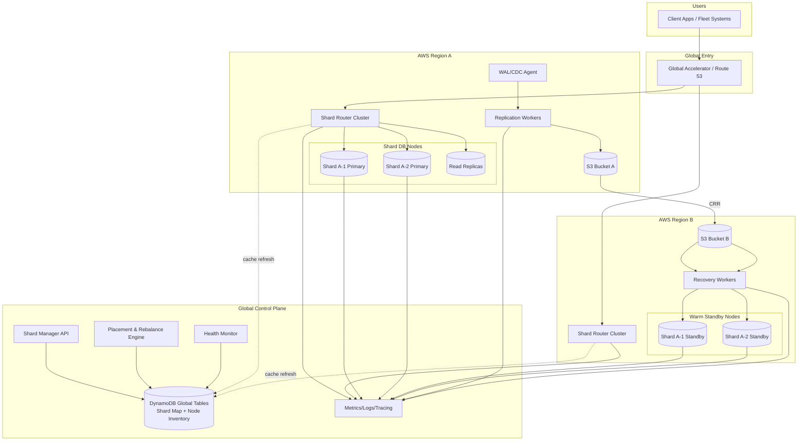

# FleetShard – Global Fleet Database Sharding (AWS-Oriented)

This repo scaffolds a multi-tenant SaaS for global fleet data with 500–1000 database servers across AWS regions. It includes:

- Control plane API for tenants, fleets, shard maps, failover/failback orchestration
- Regional routers with shard-map cache and read/write policy decisions
- Background workers for replication, recovery, health, and rebalance workflows
- Next.js admin console for onboarding, shard visualization, and incidents
- Terraform skeleton for multi-region VPC, EKS/EC2 nodes, S3 CRR, DynamoDB Global Tables

## Quick Start (monorepo)

```bash
npm install
npm run dev:api      # control-plane-api (Fastify)
npm run dev:router   # router service
npm run dev:workers  # worker simulator
npm run dev:web      # Next.js admin console
```

## Repo Layout
- `control-plane-api/` – Fastify control-plane API with placement + failover planning stubs
- `router/` – stateless shard router with cache + regional read/write decisions
- `workers/` – replication/recovery/health/rebalance worker simulator
- `web-console/` – Next.js admin console (mock data)
- `infra/` – Terraform skeleton for multi-region AWS deployment
- `docs/` – architecture notes, data models, runbooks

## Architecture (Mermaid)



See `docs/` for deeper design notes and runbooks.
